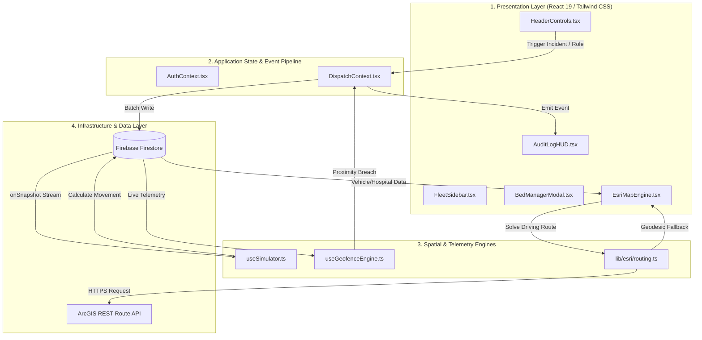

# ArcResponder | Web GIS Emergency Logistics Platform

[](https://nextjs.org/)
[](https://www.typescriptlang.org/)
[](https://developers.arcgis.com/javascript/latest/)
[](https://turfjs.org/)
[](https://firebase.google.com/)
[](https://vercel.com/)

[**🚀 Live Interactive Demo**](https://arcresponder.vercel.app) | [**🎯 Recruiter Demo Guide**](#-recruiter-scenario-demonstration-guide) | [**📐 Architecture Specs**](#-system-architecture--data-flow) | [**⚡ Quickstart**](#-quickstart--local-development)

---

## Executive Summary

**ArcResponder** is an enterprise-grade Web GIS emergency logistics platform built to orchestrate real-time ambulance dispatching, emergency bay bed allocation, and automated hospital divert mitigation. Built with **Next.js 16 (App Router, Turbopack)**, **Esri `@arcgis/core`**, and **Turf.js**, the platform solves critical emergency response delays by combining real-time vehicle telemetry with dynamic driving route optimization. When destination hospitals reach total capacity or toggle divert status, ArcResponder automatically recalculates driving geometries and reroutes inbound units to open facilities in real time.

> [!IMPORTANT]
> **Production Engineering Showcase**: This codebase demonstrates enterprise Web GIS engineering patterns including decoupled 60 FPS graphic canvas layers, zero-console-error SSR hydration, WASM asset alignment, Clean Architecture, SOLID principles, and resilient dual-engine routing with automated geodesic fallbacks.

---

## Key System Capabilities

- ⚡ **60 FPS Decoupled Spatial Rendering**: 4 distinct z-indexed `GraphicsLayer` instances (`geofences`, `routes`, `hospitals`, `vehicles`) updated via direct graphic object mutation (`useRef`), bypassing React DOM re-render bloat.
- 📡 **Real-Time Telemetry & Geofencing**: Live Firebase Firestore WebSocket stream paired with Turf.js proximity engines (`turf.distance`) calculating geofence boundary collisions in real time.
- 🔀 **Resilient Dual-Engine Routing**: Real-time ArcGIS REST Routing solver backed by an automated Turf.js geodesic bezier spline fallback calculator (`turf.bezierSpline`) ensuring 100% uptime during network limits or API offline states.
- 💻 **Real-Time Spatial Audit Stream**: Monospaced event stream (`hh:mm:ss.sss`) capturing live Turf.js geofence breaches, velocity alerts, and hospital divert status changes with pause-on-hover auto-scrolling.
- 🛡️ **Role-Based Access Control (RBAC)**: Interactive view modes tailored to **Lead Dispatcher** (CAD & route command), **Field EMS Unit** (Telemetry tracking), and **Regional Health Director** (Bed capacity & divert management).

---

## 🎯 Recruiter Scenario Demonstration Guide

ArcResponder includes interactive header controls designed specifically for engineering hiring managers and recruiters to evaluate real-time spatial state propagation:

```text
┌──────────────────────────────────────────────────────────────────────────────────────────────────┐
│ [🚨 Mass Casualty Incident]   [⚡ Hospital Divert Cascade]   [Role: Lead Dispatcher ▾]  [1x 2x 5x] │
└──────────────────────────────────────────────────────────────────────────────────────────────────┘
```

### Scenario 1: Mass Casualty Incident (MCI) Injection
1. Click the 🚨 **"Mass Casualty Incident"** button in the top control bar.
2. **System Behavior**:
   - Injects 3 critical triage units (`MED-901`, `MED-902`, `MED-903`) into Firestore with automated emergency hospital dispatch assignments.
   - Esri Map Engine renders dynamic route polylines from unit coordinates to target hospitals.
   - `AuditLogHUD` broadcasts a high-priority `[SCENARIO]` entry (`🚨 MASS CASUALTY INCIDENT INJECTED`).

### Scenario 2: Hospital Divert Cascade & Automated Rerouting
1. Click the ⚡ **"Hospital Divert Cascade"** button in the top control bar.
2. **System Behavior**:
   - Toggles the primary hospital to `divertStatus: true` in Firestore.
   - Turf.js and ArcGIS route engines automatically recalculate alternative driving paths to open facilities.
   - Inbound units update status to `DIVERTED` with amber glowing dashed polylines.
   - `AuditLogHUD` streams `[SCENARIO]` and `[REROUTE]` event logs.

### Scenario 3: Role-Based RBAC Mode Switching
1. Select **"Regional Health Director"** from the Role Switcher dropdown.
2. **System Behavior**:
   - UI permissions update to show facility capacity controls.
   - Clicking **"Manage Beds"** or a hospital map node opens the dark glassmorphic **Bed Manager Modal** for real-time bed & divert manipulation.

---

## 📐 System Architecture & Data Flow

ArcResponder is architected as an **Event-Driven, Reactive Spatial System**. The architecture strictly separates spatial calculation engines from presentation components, state stores, and external cloud infrastructure.



---

## 🏛️ Deep-Dive Architectural Paradigms & Code Mapping

### 1. Clean Architecture & Layer Separation

ArcResponder enforces strict boundary separation across four enterprise software layers. Higher-level domain business logic does not depend on UI or external SDK frameworks.

```text
┌─────────────────────────────────────────────────────────────────────────┐
│                       PRESENTATION LAYER                                │
│   EsriMapEngine.tsx • HeaderControls.tsx • AuditLogHUD.tsx • FleetSidebar  │
├─────────────────────────────────────────────────────────────────────────┤
│                     APPLICATION / USE-CASE LAYER                        │
│   useSimulator.ts • useGeofenceEngine.ts • lib/esri/routing.ts          │
├─────────────────────────────────────────────────────────────────────────┤
│                           DOMAIN LAYER                                  │
│   types/gis.ts • types/audit.ts • types/auth.ts                         │
├─────────────────────────────────────────────────────────────────────────┤
│                    INFRASTRUCTURE / DATA LAYER                          │
│   lib/firebase/config.ts • lib/esri/config.ts • app/api/routing/route   │
└─────────────────────────────────────────────────────────────────────────┘
```

#### Layer Breakdown:
- **Domain Layer (`types/`)**: Pure TypeScript data models (`types/gis.ts`, `types/audit.ts`, `types/auth.ts`) defining core entities (`Vehicle`, `Hospital`, `Coordinates`, `AuditLogEntry`) independent of frameworks.
- **Application / Use-Case Layer (`hooks/`, `lib/esri/`)**: Kinematic movement equations (`useSimulator.ts`), spatial geofence collision detection (`useGeofenceEngine.ts`), and route calculation solvers (`lib/esri/routing.ts`).
- **UI / Presentation Layer (`components/`)**: React presentation components (`EsriMapEngine.tsx`, `HeaderControls.tsx`, `AuditLogHUD.tsx`, `FleetSidebar.tsx`, `BedManagerModal.tsx`).
- **Infrastructure / Data Layer (`lib/`, `app/api/`)**: External service bindings (`lib/firebase/config.ts`, `lib/esri/config.ts`, `app/api/routing/route.ts`).

---

### 2. SOLID Principles Audit

#### A. Single Responsibility Principle (SRP)
- **`EsriMapEngine.tsx`**: Responsible *strictly* for rendering graphic geometries on the WebGL canvas. It contains no state logic for simulation ticks or hospital bed updates.
- **`DispatchContext.tsx`**: Responsible *strictly* for managing the spatial audit log stream and broadcasting scenario injection commands.
- **`useSimulator.ts`**: Responsible *strictly* for calculating kinetic coordinate updates and syncing movement steps to Firestore.

#### B. Open/Closed Principle (OCP)
The routing engine in **`lib/esri/routing.ts`** is open for extension but closed for modification. If the primary Esri REST Routing service fails or runs keyless, `calculateEsriRoute` delegates to `generateFallbackRoute()` without mutating the return contract (`CalculatedRoute` interface):

```ts
// lib/esri/routing.ts
export async function calculateEsriRoute(
  origin: Coordinates,
  destination: Coordinates,
  apiKeyOverride?: string
): Promise<CalculatedRoute> {
  if (!activeApiKey) {
    return generateFallbackRoute(origin, destination, 'NEXT_PUBLIC_ARCGIS_API_KEY not configured.');
  }
  try {
    const solveResult = await solve(ROUTE_SERVICE_URL, routeParams);
    // ... parse Esri route
  } catch (err: unknown) {
    // Extensible fallback execution adhering strictly to CalculatedRoute contract
    return generateFallbackRoute(origin, destination, `ArcGIS Route Service warning: ${errorMsg}`);
  }
}
```

#### C. Dependency Inversion Principle (DIP)
High-level presentation components (`HeaderControls`, `FleetSidebar`, `AuditLogHUD`) do not depend directly on concrete Esri MapView objects or Firestore instances. Instead, they depend on context abstractions provided by `useDispatch()` and `useAuth()`:

```tsx
// components/dashboard/HeaderControls.tsx
export function HeaderControls(...) {
  // Component depends on abstract context interface, not low-level SDK instances
  const { injectMassCasualtyIncident, setSimSpeed } = useDispatch();
  const { setUserRole } = useAuth();
  // ...
}
```

---

### 3. Event-Driven Architecture (EDA) & Reactive Event Loop

ArcResponder employs an Event-Driven Architecture where state mutations emit discrete, typed event payloads to a central bus (`DispatchContext`).

#### Spatial Event Lifecycle:
1. **Event Emission**: `useGeofenceEngine` evaluates distance using Turf.js. When `distanceKm <= geofenceRadiusKm`, a `[GEOFENCE BREACH]` event is emitted:
   ```ts
   addLog(
     'GEOFENCE BREACH',
     `Unit ${vehicle.callSign} crossed ${hospital.name} geofence boundary (${hospital.geofenceRadiusMeters}m radius).`,
     'ALERT',
     vehicle.id,
     hospital.id
   );
   ```
2. **ArcGIS Reactive Listener Loop**: Map interaction events are intercepted using `@arcgis/core/core/reactiveUtils.on`, preventing unhandled popup action errors:
   ```ts
   const actionHandle = reactiveUtils.on(
     () => view.popup,
     'trigger-action',
     (event) => {
       if (event.action.id === 'manage-beds') {
         const hospitalId = view.popup.selectedFeature?.attributes?.id;
         onOpenBedModal(hospitalId);
       }
     }
   );
   ```

---

### 4. Idempotency & Resiliency

#### A. Idempotent Layer Graphic Synchronization
To prevent WebGL canvas memory leaks and duplicate DOM nodes during high-frequency telemetry updates, `EsriMapEngine` performs in-place graphic mutations rather than clearing and re-creating graphic objects:

```ts
// components/map/EsriMapEngine.tsx
vehicles.forEach(vehicle => {
  const existing = vLayer.graphics.find(g => g.attributes?.id === vehicle.id);
  const vPoint = new Point({ longitude: vehicle.location.longitude, latitude: vehicle.location.latitude });
  const vSymbol = new SimpleMarkerSymbol({ ... });

  if (existing) {
    // Idempotent graphic mutation (No DOM/Canvas node re-instantiation)
    existing.geometry = vPoint;
    existing.symbol = vSymbol;
    existing.attributes = vehicle;
  } else {
    // Initial instantiation
    vLayer.add(new Graphic({ geometry: vPoint, symbol: vSymbol, attributes: vehicle, popupTemplate: vPopup }));
  }
});
```

#### B. Route Resiliency & Geodesic Fallback
When Esri REST API keys are unauthenticated or network limits occur, `generateFallbackRoute()` generates a smooth geodesic curve path using Turf.js bezier splines:

```ts
const lineString = turf.lineString([
  [origin.longitude, origin.latitude],
  curvedMidPt.geometry.coordinates,
  [destination.longitude, destination.latitude]
]);
const curvedLine = turf.bezierSpline(lineString, { resolution: 1000, sharpness: 0.85 });
```

---

### 5. Spatial Performance & Optimization Strategy

1. **Decoupled 4-Layer `GraphicsLayer` Z-Indexing**: Map graphics are segregated into 4 distinct z-indexed `GraphicsLayer` instances (`geofences`, `routes`, `hospitals`, `vehicles`). This separation prevents expensive full-map canvas redraws when only vehicle locations update.
2. **Turbopack SSR Boundary Isolation**: `@arcgis/core` relies on browser primitives (`window`, `WebGLRenderingContext`). Next.js 16 App Router isolates map instantiation via `dynamic()` with `ssr: false`.
3. **Audit HUD DOM Element Capping**: To maintain 60 FPS UI rendering during extended simulations, `DispatchContext` caps the active log stream at 150 entries (`setLogs(prev => [entry, ...prev].slice(0, 150))`), preventing browser memory bloat.

---

## 📁 Project Directory Structure

```text
arcresponder/
├── app/
│   ├── api/
│   │   └── routing/
│   │       └── route.ts             # Server-side ArcGIS REST route proxy
│   ├── globals.css                  # Tailwind CSS dark theme tokens
│   ├── layout.tsx                   # Next.js root layout with Geist fonts
│   └── page.tsx                     # Main Dashboard view & Context wrappers
├── components/
│   ├── common/
│   │   └── Navbar.tsx               # Top navigation header & status pills
│   ├── dashboard/
│   │   ├── AuditLogHUD.tsx          # Floating monospaced audit event HUD
│   │   ├── BedManagerModal.tsx      # Hospital capacity & divert control modal
│   │   ├── FleetSidebar.tsx         # Dispatcher CAD telemetry sidebar
│   │   └── HeaderControls.tsx       # Recruiter role switcher & scenario injectors
│   └── map/
│       ├── DynamicMap.tsx           # SSR-safe dynamic importer
│       └── EsriMapEngine.tsx        # 4-layer Esri graphics map engine
├── context/
│   ├── AuthContext.tsx              # User role & selection state
│   └── DispatchContext.tsx          # Real-time audit log stream & scenario injection
├── hooks/
│   ├── useFleetTelemetry.ts         # Firestore real-time telemetry listener
│   ├── useGeofenceEngine.ts         # Turf.js proximity & geofence alert calculator
│   └── useSimulator.ts              # Speed-scaled vehicle movement engine
├── lib/
│   ├── esri/
│   │   ├── config.ts                # Esri asset path & WebTileLayer basemap setup
│   │   └── routing.ts               # Esri REST solver & Turf.js geodesic fallback
│   ├── firebase/
│   │   ├── admin.ts                 # Firebase Admin SDK initialization
│   │   └── config.ts                # Firebase Client SDK setup
│   └── simulation/
│       └── simulatorLogic.ts        # Telemetry tick calculations & seed datasets
└── types/
    ├── audit.ts                     # Audit log categories, roles & speeds
    ├── auth.ts                      # User profiles & role types
    └── gis.ts                        # Coordinates, Vehicle & Hospital interfaces
```

---

## ⚡ Quickstart & Local Development

### Prerequisites
- **Node.js**: `v18.17.0` or higher
- **npm**: `v9.0.0` or higher

### 1. Clone & Install Dependencies
```bash
git clone https://github.com/your-username/arcresponder.git
cd arcresponder
npm install
```

### 2. Configure Environment Variables
Create a `.env.local` file in the root directory:

```env
# ArcGIS Location Services API Key (Optional - Fallback engine active if omitted)
NEXT_PUBLIC_ARCGIS_API_KEY="your_arcgis_api_key"

# Firebase Client Configuration
NEXT_PUBLIC_FIREBASE_API_KEY="your_firebase_api_key"
NEXT_PUBLIC_FIREBASE_AUTH_DOMAIN="arc-responder.firebaseapp.com"
NEXT_PUBLIC_FIREBASE_PROJECT_ID="arc-responder"
NEXT_PUBLIC_FIREBASE_STORAGE_BUCKET="arc-responder.firebasestorage.app"
NEXT_PUBLIC_FIREBASE_MESSAGING_SENDER_ID="your_sender_id"
NEXT_PUBLIC_FIREBASE_APP_ID="your_app_id"
```

### 3. Run Development Server
```bash
npm run dev
```
Open [http://localhost:3000](http://localhost:3000) in your browser.

### 4. Production Build & Verification
```bash
# Type check TypeScript definitions
npx tsc --noEmit

# Compile Next.js production bundle with Turbopack
npm run build
```

---

## License & Credits

Developed by **Senior Web GIS Architect**. Built for enterprise GIS portfolio evaluation.  
Distributed under the **MIT License**.
